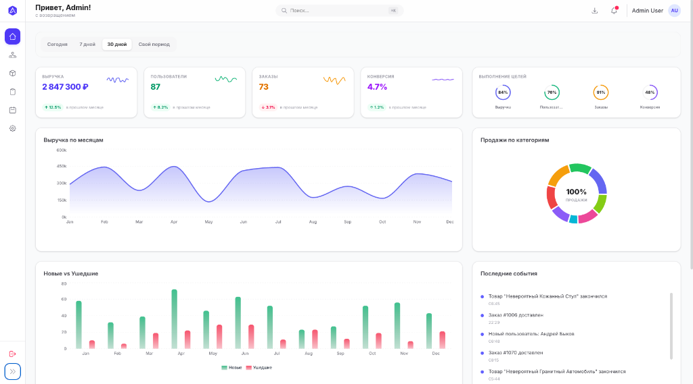

<div align="center">

# ⚡ Modern Admin Dashboard Panel

### Next-generation responsive administration panel built with Next.js 16, Redux Toolkit, and Tailwind CSS v4

[](https://nextjs.org/)
[](https://react.dev/)
[](https://redux-toolkit.js.org/)
[](https://tailwindcss.com/)

**English** | [Русский](README.ru.md)

</div>

---

## 🌟 Preview



---

## ✨ Features

<table>
<tr>
<td width="50%">

### 🎨 User Interface & Styling

- **Modern Glassmorphic Design**
  - Harmonious and vibrant HSL colors
  - Responsive layouts (Mobile-first grid systems)
  - Animated UI interactions & micro-transitions
- **Sleek Light & Dark Themes**
  - Full support for light, dark, and system color preferences
  - Integrated Radix UI component states
  - Elegant charts customized for each theme

- **Interactive Dashboard Widgets**
  - Dynamic collapsing navigation sidebar
  - Header search, calendar panel, and notifications
  - Real-time performance indicators

</td>
<td width="50%">

### ⚙️ Functionality & Core Architecture

- **State Management & Caching**
  - Unified Redux Toolkit global store configuration
  - Asynchronous queries and endpoints using RTK Query
  - Dynamic API route handling without aggressive caching

- **Rich Administrative Modules**
  - **Analytics:** Key KPI metrics, sparkline graphs, spline area revenue charts, sales by category, and activity heatmaps
  - **User & Catalog Directory:** Complete pagination, filtering, searching, role-based controls, and CRUD operations
  - **Calendar Event Manager:** Interactive task scheduler with date filtering, persisted on local storage

</td>
</tr>
</table>

---

## 📦 Installation & Setup

### Prerequisites

Make sure you have [Node.js](https://nodejs.org/) (v18.x or newer) installed.

### Step 1: Clone the Repository

```bash
git clone https://github.com/S1ach/AdminPanel.git
cd AdminPanel
```

### Step 2: Install Dependencies

```bash
npm install
```

### Step 3: Run the Development Server

```bash
npm run dev
```

Open [http://localhost:3000](http://localhost:3000) inside your web browser to view the application.

### Step 4: Production Build

To build a production bundle and run the server:

```bash
npm run build
npm run start
```

---

## ⚙️ Configuration & Features

### Complete Tech Stack

| Technology        | Purpose                                 | Version   |
| :---------------- | :-------------------------------------- | :-------- |
| **Next.js**       | Core React SSR / App Router Framework   | `16.2.6`  |
| **React**         | Front-end Library                       | `19.2.4`  |
| **Redux Toolkit** | State & RTK Query Management            | `2.12.0`  |
| **Tailwind CSS**  | Premium Layouts & Glassmorphism Styling | `v4.0.0`  |
| **Recharts**      | Interactive SVG charts                  | `3.8.1`   |
| **Radix UI**      | Unstyled accessible React components    | `^1.1`    |
| **Faker.js**      | Mock generation framework               | `^10.4.0` |

---

## 📖 Project Architecture

The directory layout adheres to Feature-Sliced Design (FSD) architecture principles for maximum scalability:

```
src/
├── app/                  # Application initialization (styles, providers, routing, store)
│   ├── (dashboard)/      # Protected dashboard layouts & subpages
│   │   ├── calendar/     # Interactive scheduler page
│   │   ├── orders/       # Directory of orders
│   │   ├── products/     # Catalog directory
│   │   ├── settings/     # Localization & profile preferences
│   │   └── users/        # Users administration view
│   ├── api/              # API route implementations
│   └── store/            # Redux store bindings
├── entities/             # Business units (analytics, users, products, orders)
├── shared/               # Reusable primitives, UI, i18n, icons, types
└── widgets/              # Page layouts (sidebar navigation, top-level headers)
```

### Path Aliases Reference

For absolute file imports, configure compilation parameters using:

- `@app/*` points to `src/app/*`
- `@widgets/*` points to `src/widgets/*`
- `@features/*` points to `src/features/*`
- `@entities/*` points to `src/entities/*`
- `@shared/*` points to `src/shared/*`

---

## 🛠️ Code Style & Quality Control

Husky and lint-staged automated hooks validate files on commit:

- **Linting:** Standard Next.js & ESLint configurations (`npm run lint`).
- **Formatting:** Prettier standard configuration (`npm run format`).
